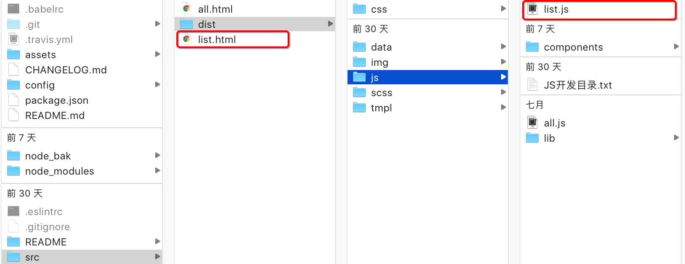

# Webpack+React集成环境框架

一个完善的Webpack+React集成环境,支持模块热加载和Css热加载效果,并支持多页面入口的Webpack打包,并附加完整的config配置文件注释,可以方便的修改环境及配置

##使用的技术

- [x] [Webpack](https://webpack.github.io)
- [x] [React](https://facebook.github.io/react/)
- [x] [Babel](https://babeljs.io/)
- [x] [Koa](https://github.com/koajs/koa)
- [x] [PostCSS](https://github.com/postcss/postcss)
- [x] [precss](https://github.com/jonathantneal/precss)
- [x] [CSS modules](https://github.com/outpunk/postcss-modules)
- [x] [autoprefixer](https://github.com/postcss/autoprefixer)
- [x] [webpack-dashboard](https://github.com/FormidableLabs/webpack-dashboard)

## 安装方法

```
npm install
```

## 启动热加载React框架

```
npm start
```
## 发布自动打包
```
npm run build 
```

## 新建页面系统
只需要在src中创建一个文件,并在src/dist/js中创建一个同名js即可

## 其他注意
由于背景图路径问题,修改了file-loader模块,所以请安装完后替换为/node_bak中的模块,用以支持背景图打包生成的地址问题

## 增加控制台



# License 

MIT

